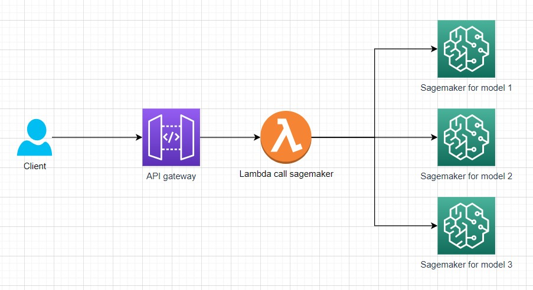

# Deploy a custom Machine Learning Model with AWS Sagemaker

Support deploying AI models to AWS for easy use through Rest API.

The tools are friendly even to developers who are not familiar with aws.



## Useful commands
### Create new model
 * Run command `./run.sh create <id>` to create new model
 * Show help `./run.sh create -h`

Example create new model `sample`
``` 
$ ./run.sh create sample
```
Result
```

create sample

> ai-mobile-app@0.1.0 create
> node script/run.js create "sample"

Model sample created successfully.
├───📁 bin/
│   └───📁 lib/
│       └───📁 model/
│           └───📁 config/
│               └───📄 sample.json    <-- config for cdk/docker
├───📁 docker/
│   ├───📁 build-config/
│   │   └───📁 sample/
│   │       └───📄 requirements.txt   <-- requirements
│   └───📁 model/
│       └───📁 sample/
│           └───📄 inference.py       <-- edit predict code here
└───📁 weightAndConfig/
    └───📁 sample/                    <-- config and weight for model predict

```

### Run local
* Require: docker
* Run command `./run.sh local <id>`

Request example:
```shell
curl --location --request POST 'localhost:8080/invocations' \
--header 'Content-Type: application/json' \
--data-raw '{"img": "base64 image"}'
```

### Deploy model
* Run command `./run.sh deploy <id> <-p aws_profile> <-e env_name> [-u]` to deploy model to aws

* Show help: `./run.sh deploy -h`

Example deploy `sample` model that was created above
```
$ ./run.sh deploy sample -p profile -e prod -u
```
[WARNING] `-u` option to upload config and weights for the model (stored in directory `weightAndConfig/<id model>`). If there are no changes config or weights, this option can be ignored.

### Remove model
* Run command `./run.sh remove <id> <-p aws_profile> <-e env_name> [-u]` to remove model

* Show help: `./run.sh remove -h`


# Weight and config model
Because the weight file is large in size, it should be stored on dropbox https://www.dropbox.com/sh/pllp7fhryas5ees/AADTvgSCVIJHO2g9U4VwreqHa?dl=0. If there are changes, copy them to the source code to deploy but don't commit them.